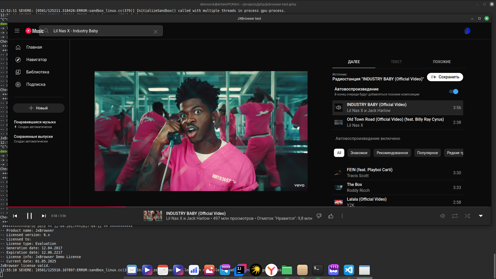
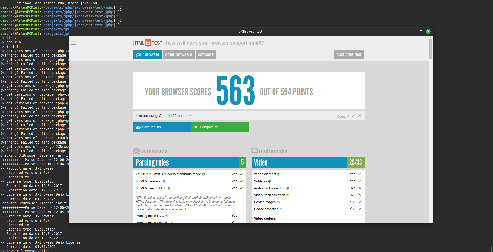

# jxbrowser-wrapper-jphp
## ❗ Отказ от ответственности

> **⚠️ ВАЖНО:** Данный репозиторий предназначен исключительно для образовательных и демонстрационных целей. Автор **не несёт никакой ответственности** за любое несанкционированное использование данной обёртки, включая (но не ограничиваясь) попытки обхода лицензирования JxBrowser с помощью упомянутого хака. Использование хака нарушает [Лицензионное соглашение TeamDev](https://www.teamdev.com/jxbrowser#licensing-and-pricing), и может повлечь за собой юридические последствия.  
>  
> Автор не поощряет, не поддерживает и **не несёт ответственности** за использование хака ни в каких целях, кроме как для **локального тестирования** или ознакомления. Вся ответственность за возможные последствия (включая юридические, технические и моральные) при использовании взлома ложится **исключительно на пользователя**.  
>  
> Пожалуйста, приобретите официальную лицензию JxBrowser для использования в продакшене: [https://teamdev.com/jxbrowser](https://teamdev.com/jxbrowser)

Обёртка над [JxBrowser 6.24.3](https://www.teamdev.com/jxbrowser) для использования в проектах на JPHP через JPPM.
## Скриншоты

  
*Youtube music*
  
*Html5 test*
## Описание

Пакет позволяет быстро интегрировать компонент браузера JxBrowser в ваши GUI-приложения на JPHP. После установки через JPPM достаточно создать форму и добавить в неё `UXJXBrowser` — обёртку над JxBrowser.
> Пожалуйста, приобретите официальную лицензию JxBrowser для использования в продакшене: [https://teamdev.com/jxbrowser](https://teamdev.com/jxbrowser)

## Требования 
- JPPM  OR DevelNext 16
- Java 8+  
> Пожалуйста, приобретите официальную лицензию JxBrowser для использования в продакшене: [https://teamdev.com/jxbrowser](https://teamdev.com/jxbrowser)
## Как использовать?
```php
<?php
// Создаём форму
$form = new \php\gui\UXForm(); //<----- пример под jphp(jppm)
$form->title = 'JXBrowser test';
$form->show();

// Создаём и настраиваем браузер
$browserJX = new \php\gui\jxbrowser\UXJXBrowser();
$browserJX->engine->url     = 'https://html5test.com/';
$browserJX->size            = [800, 600];
$browserJX->leftAnchor      = 0;
$browserJX->topAnchor       = 0;
$browserJX->rightAnchor     = 0;
$browserJX->bottomAnchor    = 0;

// Добавляем браузер в форму
$form->add($browserJX);
```
<sub>⚠️ Предупреждение: Использование хака без лицензии JXBrowser нарушает условия соглашения TeamDev. Данный репозиторий - только пример интеграции. Чтобы воспользоваться взломом, используйте ```php teamDev\jxbrowser\hack\JXBrowserHack::hack(); // Initialize JXBrowser Hack```. РЕКОМЕНДУЕТСЯ ТОЛЬКО ДЛЯ ТЕСТА! КУПИТЬ ЛИЦЕНЗИЮ МОЖНО [ТУТ](https://teamdev.com/jxbrowser/#licensing-and-pricing)</sub>
> Пожалуйста, приобретите официальную лицензию JxBrowser для использования в продакшене: [https://teamdev.com/jxbrowser](https://teamdev.com/jxbrowser)
